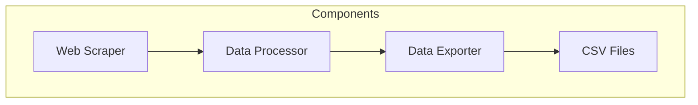
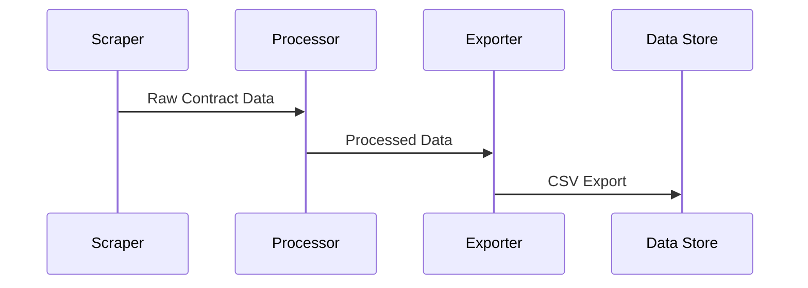
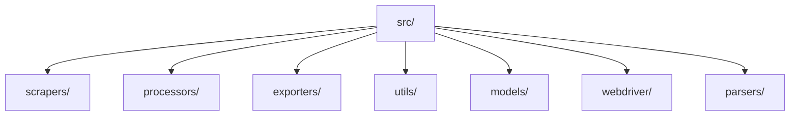

# DOGE Tracker

A Python-based tool for tracking and analyzing DOGE (Defense of Government Efficiency) savings data from government contracts.

## Project Overview

This project scrapes and processes DOGE savings data from government contracts, providing insights into cost savings and contract modifications.

## Architecture



## Data Flow



## Project Structure



## Dependencies

- Python 3.x
- selenium==4.31
- requests==2.32.3
- pandas
- BeautifulSoup4
- coloredlogs==15.0.1

## Configuration

The project uses a `settings.py` file for configuration, including:
- API endpoints
- Retry settings
- Data field mappings
- File paths

## Data Fields

The system tracks the following fields for each contract:
- PIID (Procurement Instrument Identifier)
- Agency
- Vendor
- Value
- Description
- FPDS Status
- FPDS Link
- Deleted Date
- Savings

## Getting Started

1. Clone the repository
2. Create a virtual environment:
   ```bash
   python -m venv .venv
   source .venv/bin/activate  # On Unix/macOS
   ```
3. Install dependencies:
   ```bash
   pip install -r requirements.txt
   ```
4. Run the main script:
   ```bash
   python src/main.py
   ```

## Data Storage

Processed data is stored in CSV format in the `data/` directory, with raw API data saved to `data/doge_raw_api_data.csv`. 